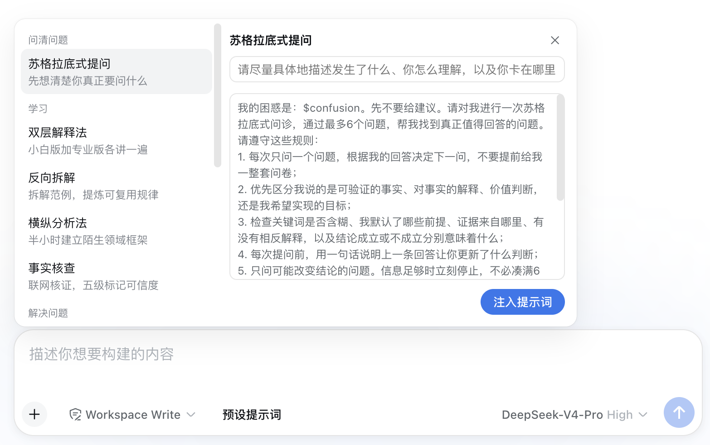
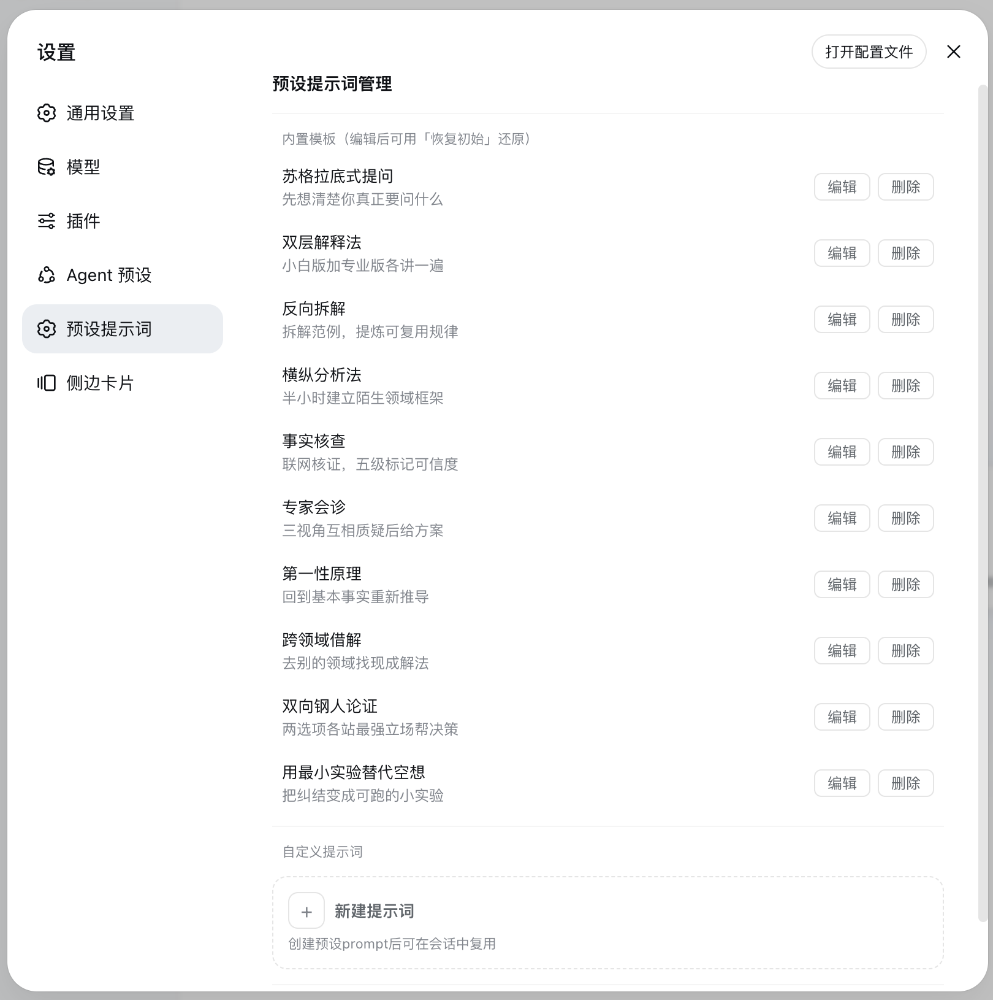

# dsh-preset-prompts

为 [DeepSeek Harness (DSH)](https://github.com/deepseek-ai/DeepSeek-Harness) Web 打造的**预设提示词插件**：10 条内置思维框架提示词 + 一套可自定义的提示词体系（变量、分组、版本历史），在输入框上方弹出面板，一键注入会话。

## 截图

### 输入框上方的「预设提示词」面板



选一个模板 → 填变量 → 预览（有序列表自动换行）→ 一键「注入提示词」，输入框自动聚焦、光标停在文案结尾。

### 设置页 · 预设提示词



内置模板可编辑、删除、按条「恢复初始」；自定义提示词支持名称 / 应用场景 / 分组 / 变量 / 版本历史。

## 功能

- **10 条内置思维框架**：苏格拉底式提问 / 双层解释法 / 反向拆解 / 横纵分析法 / 事实核查 / 专家会诊 / 第一性原理 / 跨领域借解 / 双向钢人论证 / 用最小实验替代空想
- **自定义提示词**：名称、应用场景、所属分组（可自定义）；变量用 `$变量名` 表达，正文里以 chip 组件的形态编辑，输入 `$` 弹出联想插入；版本历史最多 10 版可回退
- **面板**：选模板 → 填变量 → 预览 → 注入输入框（自动聚焦、光标置尾）
- **内置模板可编辑、删除、恢复初始**
- 附带的 `fact_check` 模型工具：事实核查（五级核查法的联网版），Agent 可在任务中自主调用
- **数据本地落盘**（`~/.askit/prompts.json`），不做任何云同步

## 安装

### 一键安装（npm）

```bash
dsh plugin --profile web add dsh-preset-prompts@latest
# 重启 dsh web
```

> 如果你用的 profile 名不是 `web`，把命令里的 `web` 换成你自己的 profile 名。

### 从 GitHub 安装

```bash
dsh plugin --profile web add "github:roxorlt/dsh-preset-prompts#main"
```

安装后自动挂载：输入框工具行出现「预设提示词」按钮；设置面板新增「预设提示词」管理页。全程不用改任何配置文件。

### 交给 Agent 自主安装

DSH 的 Agent 具备终端执行能力，直接对它说一句即可：

> 帮我把 `dsh-preset-prompts` 插件装上：执行 `dsh plugin --profile web add dsh-preset-prompts@latest`，装完提示我重启 `dsh web`。

Agent 会自己跑安装命令（这个包带 `cordis.patch.yml` 自动挂载声明，安装即挂载，无需额外配置）。

## 反馈

- 反馈问题：[kozan.fider.io](https://kozan.fider.io/)
- 作者：[roxorlt](https://github.com/roxorlt)

## License

[MIT](./LICENSE)
